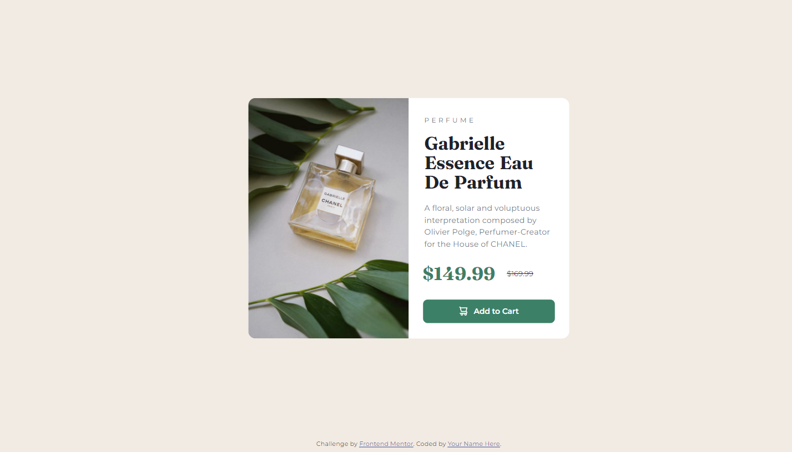

# Frontend Mentor - Product preview card component solution

This is a solution to the [Product preview card component challenge on Frontend Mentor](https://www.frontendmentor.io/challenges/product-preview-card-component-GO7UmttRfa). Frontend Mentor challenges help you improve your coding skills by building realistic projects. 

## Table of contents

- [Overview](#overview)
  - [The challenge](#the-challenge)
  - [Screenshot](#screenshot)
- [My process](#my-process)
  - [Built with](#built-with)

## Overview

Landing responsive page of a product from an e-commerce. 

### The challenge

Users should be able to:

- View the optimal layout depending on their device's screen size
- See hover and focus states for interactive elements

### Screenshot

## My process

I usually start from desktop size to mobile size but this time I started from mobile and I think I found it easier the part where I got stuck was when I had to transform the vertical desing to a horizontal one. It took me a while to figure it out how to, but at the end I could finish the project and I feel great about it :), I keep learning new things and practicing the stuff I already knew about. 

### Built with

- Semantic HTML5 markup
- CSS custom properties
- Flexbox
- CSS Grid
